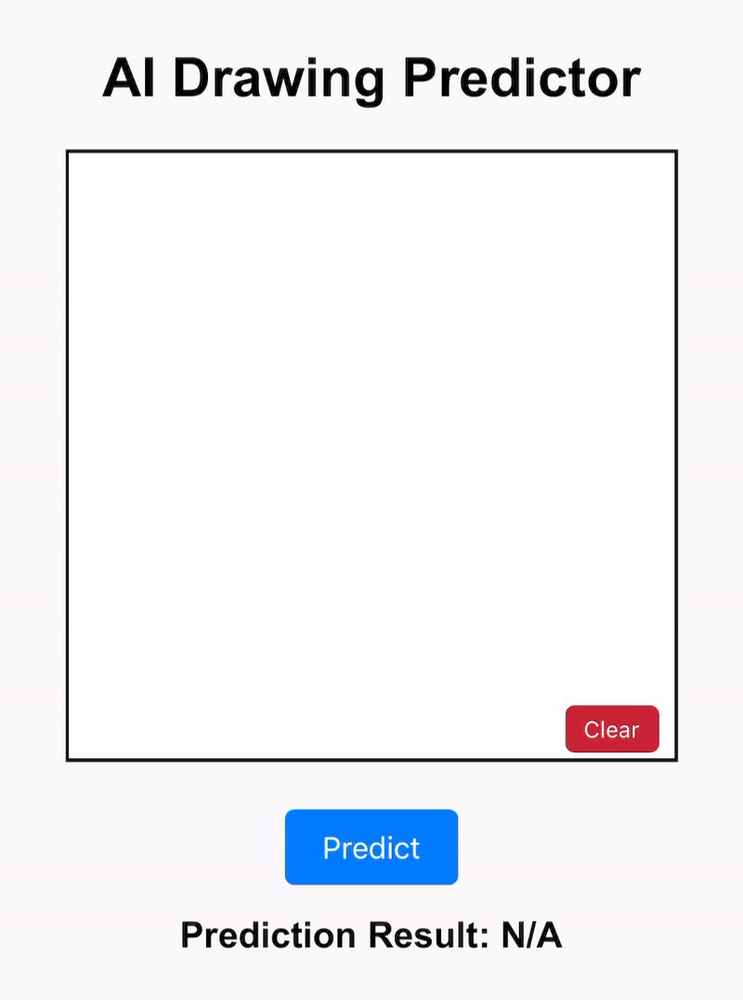

# **QuickDraw ResNet Predictor**

*The above GIF demonstrates how the QuickDraw model performs in action.*

This project uses the Google Quick, Draw! dataset to classify simple sketches using a ResNet-based deep learning model. The trained model has been converted to TensorFlow.js for web deployment, enabling users to test predictions through a simple web interface.

[**Live Demo**](http://asj.dothome.co.kr/quickdraw/test)

## **1. Introduction**
- This project employs a ResNet-based model to classify sketches from the Kaggle Quick, Draw! dataset.
- The dataset consists of `.npy` files, where each image is a grayscale sketch with a size of **28x28 pixels**.
- Various **data augmentation techniques** have been applied during training to improve model performance.
- The trained Keras model is converted to TensorFlow.js for seamless usage in a web environment.

## **2. Key Features**
- **Residual Network (ResNet):**
  - Implements Residual Block structures to enhance learning efficiency.
  - Custom-built using TensorFlow/Keras.
- **TensorFlow.js Integration:**
  - Converts the trained Keras model to TensorFlow.js format for use in web applications.
  - The converted model is stored in `web/tfjs_model/`.
- **Data Augmentation:**
  - Enhances the training data with transformations to improve model robustness.
  - Applied techniques include:
    - Rotation (±15 degrees)
    - Horizontal and vertical shifts (10%)
    - Zooming (±10%)
    - Horizontal flips
- **Web Interface:**
  - Built with HTML, CSS, and JavaScript for user-friendly interaction.
  - Allows users to upload sketches and view classification results.

## **3. Project Structure**
```QuickDraw-Predictor/ │ ├── README.md # Project documentation ├── requirements.txt # Python dependencies ├── data/ # Dataset files (.npy format) │ ├── full_dataset.npz ├── model/ # Trained model and class mapping │ ├── resnet_quickdraw_model.h5 │ ├── class.json # Class name-to-index mapping ├── src/ # Python scripts │ ├── train.py # Model training script │ └── predict.py # Model prediction script ├── web/ # Web application files │ ├── index.html # User interface (HTML) │ ├── styles.css # Styling (CSS) │ ├── app.js # Prediction logic (JavaScript) │ ├── tfjs_model/ # TensorFlow.js model │ ├── model.json │ ├── group1-shard1of1 │ ├── class.json # Class name-to-index mapping └── LICENSE # License file```

## **4. Important Notes on Usage**
- **Input Image Preprocessing:**
  - The model requires input images to be preprocessed to a size of **28x28 pixels**.
  - If the original image size exceeds **512x512 pixels**, the model may struggle to classify certain classes accurately.
  - **The recommended original image size is approximately 320x320 pixels** for optimal performance.
  - Ensure that images are resized appropriately before inference.

## **5. Dataset**
- **Source:** [Kaggle QuickDraw `.npy` Dataset](https://www.kaggle.com/datasets/drbeane/quickdraw-np)
- **Details:**
  - The original dataset contains up to **100,000 samples per class** with a wide variety of sketch categories.
  - This project uses a subset of **10,000 samples per class**, totaling approximately **3.45 million images**.
- **Image Size:** All sketches are provided in **28x28 pixels**, grayscale format.

## **6. Performance**
- **Validation Accuracy:** **85.2%**
- **Test Accuracy:** **84.7%**

## **7. License**
- **Code:** MIT License  
- **Dataset:** Refer to the [Kaggle dataset page](https://www.kaggle.com/datasets/drbeane/quickdraw-np) for licensing information.  
- **Libraries:** TensorFlow/Keras (Apache 2.0 License)

## **8. Acknowledgments**
- **Dataset:** [Kaggle QuickDraw `.npy` Dataset](https://www.kaggle.com/datasets/drbeane/quickdraw-np)  
- **ResNet Paper:** [Deep Residual Learning for Image Recognition](https://arxiv.org/abs/1512.03385) by He et al.
